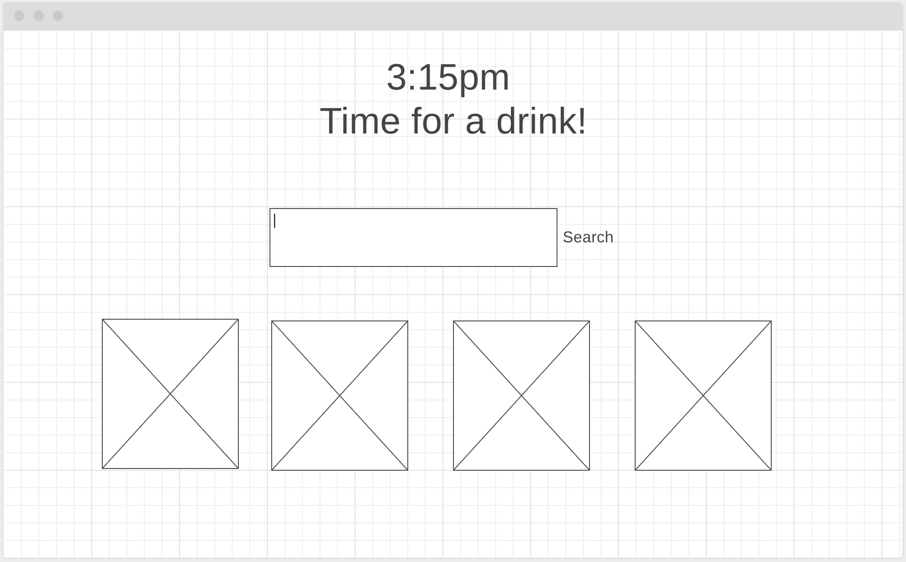
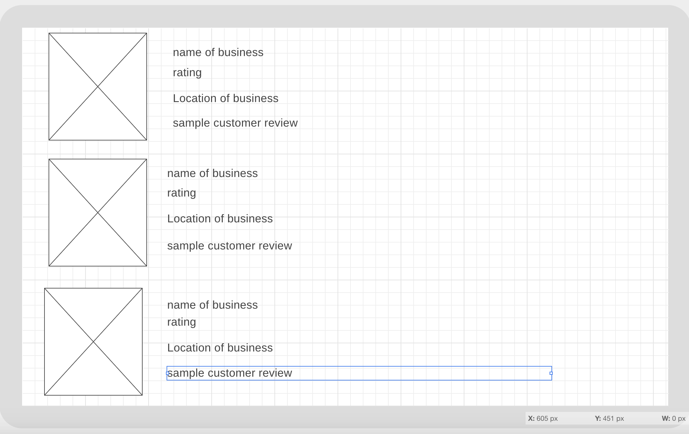

# Project Overview

## Project Name

Find Drinks

## Project Description

This is an app to help people search for drinks nearby. Drinks could be coffee, bubble tea, tea, or kombucha etc..

## API and Data Sample

Specify the API you are using and include a link. Show us a snippet of JSON returned by your API so we know you can access it and get the info you need

I will be using Foursquare's API. https://api.foursquare.com/v2/venues/explore?client_id=SVJRCTWSPPNDXTKD5QUGB4Q4210QCOM1HVTZQ1XWNQX3ED0B&client_secret=5XNAIWKWODNCHLJ5EVTGSZ3EELOKDKXVNQHBOTJ1KKDCGQFJ&near=new york, NY &query=coffee&v=20200510

{
"meta": {
"code": 200,
"requestId": "5eb8609cc8cff2001c4d80d9"
},
"response": {
"suggestedFilters": {
"header": "Tap to show:",
"filters": [
{
"name": "Open now",
"key": "openNow"
},
{
"name": "$-$$$$",
"key": "price"
}
]
},
"geocode": {
"what": "",
"where": "new york ny",
"center": {
"lat": 40.742185,
"lng": -73.992602
},
"displayString": "New York, NY, United States",
"cc": "US",
"geometry": {
"bounds": {
"ne": {
"lat": 40.882214,
"lng": -73.907
},
"sw": {
"lat": 40.679548,
"lng": -74.047285
}
}
},
"slug": "new-york-city-new-york",
"longId": "72057594043056517"
},
"headerLocation": "New York",
"headerFullLocation": "New York",
"headerLocationGranularity": "city",
"query": "coffee",
"totalResults": 158,
"suggestedBounds": {
"ne": {
"lat": 40.79267583420711,
"lng": -73.95106540766615
},
"sw": {
"lat": 40.682754579323465,
"lng": -74.01340983773018
}
},

Due to limitation issues, I've decided to use Google places API instead.  

## Wireframes

- The front page of the app will look like this. The user has to choose of the the 4 options.
  
- After the user has made a choice, the second page will look like this, which is a list of options.
  


#### MVP

- be able to search places on the front page
- given 4 options to the user to choose from
- the second page will be a list of businesses with relevant information

#### PostMVP

- when the user can can picks one of the choices from page 2, he/she will be prompted to an extended view of the business.
- enables the user to answer which business he/she chosed to keep a record
- Use local storage to save user favorites
- recommends user a random place right when the user opens the app

## Project Schedule

| Day      | Deliverable                                  | Status     |
| -------- | -------------------------------------------- | ---------- |
| May 8    | Project Prompt                               | Complete   |
| May 9-10 | Wireframes / Priority Matrix / Timeframes    | Complete   |
| May 11   | Core Application Structure (HTML, CSS, etc.) | Complete  |
| May 12   | Get data back from google places API    	  | Complete |
| May 13   | Append API data to the DOM                   | Incomplete |
| May 14   | MVP                                          | Incomplete |
| May 15   | Present                                      | Incomplete |

## Priority Matrix


## Timeframes

| Component                                                   | Priority | Estimated Time | Time Invested | Actual Time |
| ----------------------------------------------------------- | :------: | :------------: | :-----------: | :---------: |
| HTML                                                        |    L     |      2hrs      |      3        |       3     |
| CSS                                                         |    M     |      3hrs      |      4        |       4     |
| Advanced CSS                                                |    H     |      4hrs      |	 4	  |	  4	|
| search bar API                                              |    H     |      4hrs      |      4        |	  4	|
| Attach eventlisteners to pics and link them to API searches |    H     |      4hrs      |      6        |       6     |
| Appending API data to the DOM                               |    H     |      4hrs      |      6        |       6     |
| Total                                                       |    H     |     21hrs      |     27        |       27    |

## Code Snippet

Use this section to include a brief code snippet of functionality that you are proud of and a brief description.

```
function getLL(e) {
  let ll = e.coords.latitude + "," + e.coords.longitude;
  localStorage.setItem("ll", ll);
  if (localStorage.ll) {
    loadingDiv.remove();
  }
}

const error = function (err) {
  switch (err.code) {
    case err.PERMISSION_DENIED:
      alert("Location request denied");
      break;
    case err.TIMEOUT:
      alert("Request timed out");
      break;
    case err.POSITION_UNAVAILABLE:
      alert("Location service not available");
      break;
    default:
      alert("An unknown error occurred");
      break;
  }
};

if (!localStorage.ll) {
  loadingDiv.style.display = "block";
  navigator.geolocation.getCurrentPosition(getLL, error);
}
```
I am able to get the user's location and save it to a variable to save to local storage.  If the variable exists in local storage. Then it will not ask the user again for it.  

## Change Log


